# WatchPAT BLE Service Architecture & Workflow

**Comprehensive documentation of the Android BLEService.java implementation**

This document maps the complete Bluetooth Low Energy workflow from device discovery through connection, sleep study session start, and data acquisition.

---

## 🚀 Quick Start - C# Implementation

**Location**: `C:\source\itamar\WatchPATONERE`

**Status**: ✅ **VERIFIED AND WORKING** with physical WatchPAT device

### Build and Run

```bash
cd C:\source\itamar\WatchPATONERE
dotnet build
dotnet run
```

### Testing Commands

From Main Menu (not connected):
1. **Scan** (option 1) - Find ITAMAR_ devices
2. **Connect** (option 2) - Connect to device (auto-sends IS_DEVICE_PAIRED)

From Connected Menu:
1. **Start Sleep Study** (option 1) - Start recording session
2. **Receive Study Data** (option 2) - Save live DATA packets (0x0800) to file
3. **Stop Session** (option 3) - End current recording
4. **Request Status** (option 4) - Request device technical status
5. **Finger Probe Test** (option 5) - Test finger probe detection
6. **Monitor Telemetry** (option 6) - Watch incoming packets for 30 seconds
7. **LED Test** (options 7-9) - Verify protocol (LED turns on/off - PROVEN WORKING!)
   - Option 7: Turn LEDs ON
   - Option 8: Turn LEDs OFF
   - Option 9: Blink pattern (5 cycles)
8. **Request Stored Data** (option 'r') - Download completed recording from device flash

### Key Files

| File | Purpose | Status |
|------|---------|--------|
| `WatchPatPacket.cs` | 24-byte header + CRC-16 | ✅ Verified |
| `WatchPatProtocol.cs` | Command builders | ✅ Verified |
| `WatchPatDevice.cs` | BLE communication | ✅ Verified |
| `TelemetryHandler.cs` | Response parser | ✅ Verified |
| `Program.cs` | Interactive menu | ✅ Verified |

### Protocol Validation

**Proven Working:**
- ✅ SetLEDs (0x2300) - LED physically turned ON and OFF
- ✅ IS_DEVICE_PAIRED (0x2A00) - Device responds with ACK
- ✅ ACK parsing - Device acknowledgments received and parsed
- ✅ CRC-16 validation - All packets accepted by device
- ✅ 20-byte chunking - Proper BLE MTU handling

**Implemented Features:**
- ✅ Start/Stop sleep sessions (START_SESSION 0x0100, STOP_ACQUISITION 0x0700)
- ✅ Request device technical status (TECHNICAL_STATUS_REQUEST 0x1500)
- ✅ Receive and save DATA packets (0x0800) to file
- ✅ Request stored data from device flash (SEND_STORED_DATA 0x1000)
- ✅ Finger probe detection test (START_FINGER_DETECTION 0x2500)
- ✅ Device reset command (RESET_DEVICE 0x0B00)
- ✅ Complete menu-driven interactive console
- ✅ Event-driven packet processing with async/await pattern

---

## 📋 Quick Reference

### BLE Service UUIDs

| UUID | Type | Purpose |
|------|------|---------|
| `6e400001-b5a3-f393-e0a9-e50e24dcca9e` | Service | Nordic UART Service |
| `6e400002-b5a3-f393-e0a9-e50e24dcca9e` | TX Characteristic | Write commands to device (WriteWithoutResponse) |
| `6e400003-b5a3-f393-e0a9-e50e24dcca9e` | RX Characteristic | Receive notifications from device (Notify) |
| `00002902-0000-1000-8000-00805f9b34fb` | CCCD Descriptor | Client Characteristic Configuration |

### Packet Structure (24-byte header)

```
Offset  Size  Field           Description
------  ----  -----           -----------
0-1     2     Magic           0xBBBB (fixed)
2-3     2     CommandId       Command/response ID (byte-reversed)
4-11    8     Timestamp       Unix seconds (byte-reversed)
12-15   4     TransactionId   Auto-incremented ID (pre-reversed in Java)
16-17   2     Length          Total packet length (pre-reversed in Java)
18-19   2     Flags           Packet flags
20-21   2     Zero            Reserved (always 0)
22-23   2     CRC             CRC-16-CCITT checksum (pre-reversed in Java)
[24+]   var   Payload         Command-specific data
```

**Critical**: Packets split into 20-byte chunks with 10ms delay between chunks.

### Command IDs Reference

| Command ID | Decimal | Direction | Name | Purpose |
|------------|---------|-----------|------|---------|
| **Outgoing Commands** |
| 0x0100 | 256 | → Device | START_SESSION | Start sleep study recording |
| 0x0600 | 1536 | → Device | START_ACQUISITION | Start data acquisition |
| 0x0700 | 1792 | → Device | STOP_ACQUISITION | Stop current session |
| 0x0B00 | 2816 | → Device | RESET_DEVICE | Soft/hard reset |
| 0x1000 | 4096 | → Device | SEND_STORED_DATA | Request flash data |
| 0x1500 | 5376 | → Device | TECHNICAL_STATUS_REQUEST | Get device status |
| 0x2300 | 8960 | → Device | SET_LEDS | Control LEDs (0x00=off, 0xFF=on) |
| 0x2500 | 9472 | → Device | START_FINGER_DETECTION | Test finger probe |
| 0x2A00 | 10752 | → Device | IS_DEVICE_PAIRED | Check pairing (REQUIRED after connect) |
| **Incoming Responses** |
| 0x0000 | 0 | ← Device | ACK | Command acknowledgment + status |
| 0x0200 | 512 | ← Device | START_SESSION_CONFIRM | Session started OK |
| 0x0800 | 2048 | ← Device | DATA | Telemetry data (SpO2, pulse, etc.) |
| 0x0900 | 2304 | ← Device | END_OF_TEST_DATA | Recording ended |
| 0x0A00 | 2560 | ← Device | ERROR_STATUS | Device error (battery, flash) |
| 0x1600 | 5632 | ← Device | TECHNICAL_STATUS_REPORT | Status response |
| 0x2600 | 9728 | ← Device | FINGER_TEST_RESPONSE | Finger test result |
| 0x2B00 | 11008 | ← Device | IS_DEVICE_PAIRED_RESPONSE | Pairing status |

### Connection Sequence

```
1. Scan for BLE devices with name prefix "ITAMAR_"
2. Connect to GATT server
3. Discover Nordic UART Service (6e400001-...)
4. Enable notifications on RX characteristic (6e400003)
5. WAIT 1000ms for device stabilization
6. Send IS_DEVICE_PAIRED (0x2A00) command ← REQUIRED!
7. Wait for ACK or IS_DEVICE_PAIRED_RESPONSE
8. Device ready for operational commands
```

### Device Naming Convention

| Format | Example | Meaning |
|--------|---------|---------|
| `ITAMAR_[HEX]` | `ITAMAR_1A2B3C` | Standard/paired device |
| `ITAMAR_[HEX]N` | `ITAMAR_1A2B3CN` | New/unpaired device (N suffix) |

**Serial Number Conversion**: Hex → 9-digit decimal
- Example: `ITAMAR_1A2B3CN` → `0x1A2B3C` = `1715004` → `000001715004` (padded)

### CRC-16-CCITT Calculation

```
Algorithm: CRC-16-CCITT
Polynomial: 0x1021
Initial Value: 0xFFFF
Input: Entire packet with CRC field set to 0x0000
Output: 16-bit checksum (pre-reversed in Java before writing)
```

### Critical Timing Values

| Operation | Delay | Purpose |
|-----------|-------|---------|
| Post-connection wait | 1000ms | Device stabilization |
| Between chunks | 10ms | BLE flow control |
| Command retry interval | 2000ms | Wait before retry |
| Command timeout | 10000ms | Total timeout per command |
| Scan duration | 5000-10000ms | Device discovery |

### Byte Ordering Rules (CRITICAL!)

**In C# WatchPatPacket.cs Header.ToBytes():**

| Field | Reverse? | Reason |
|-------|----------|--------|
| Magic (0xBBBB) | ✅ YES | Not pre-reversed in Java |
| CommandId | ✅ YES | Not pre-reversed in Java |
| Timestamp | ✅ YES | IS pre-reversed in Java, but needs full reversal |
| TransactionId | ❌ NO | Pre-reversed with `Integer.reverseBytes()` |
| Length | ❌ NO | Pre-reversed with `Short.reverseBytes()` |
| Flags | ❌ NO | Simple 16-bit value |
| Zero | ❌ NO | Always 0x0000 |
| CRC | ❌ NO | Pre-reversed with `Short.reverseBytes()` |

**Why**: Java `ByteBuffer` writes big-endian but pre-reverses some fields. C# `BitConverter` writes little-endian natively. Must match Java's final byte output!

---

## Table of Contents

1. [BLE Service Architecture](#ble-service-architecture)
2. [Device Discovery Flow](#device-discovery-flow)
3. [Connection Establishment](#connection-establishment)
4. [GATT Service Discovery](#gatt-service-discovery)
5. [Sleep Study Session Start](#sleep-study-session-start)
6. [Data Acquisition & Telemetry](#data-acquisition--telemetry)
7. [Command/Response Flow](#commandresponse-flow)
8. [State Management](#state-management)
9. [Disconnection & Reconnection](#disconnection--reconnection)

---

## BLE Service Architecture

### Component Overview

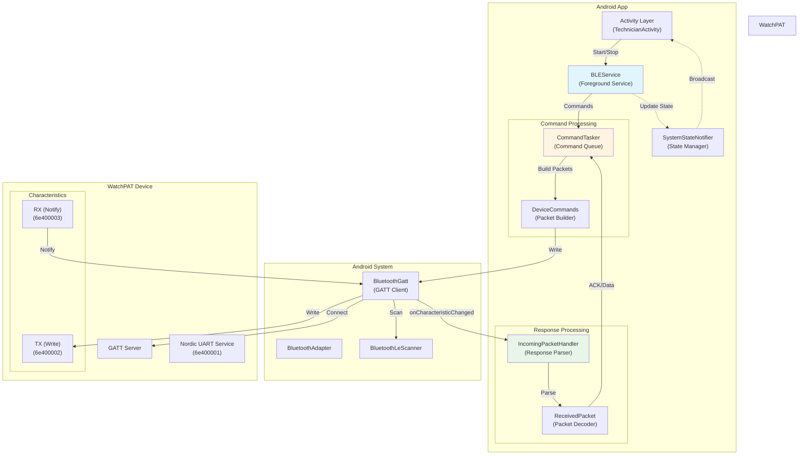

### Key Components

| Component | Purpose | Location |
|-----------|---------|----------|
| **BLEService** | Foreground service managing BLE operations | `BLEService.java:52` |
| **CommandTasker** | Queue-based command sender with retry logic | `CommandTasker.java:16` |
| **IncomingPacketHandler** | Processes incoming packets from device | `IncomingPacketHandler.java:22` |
| **DeviceCommands** | Creates protocol-compliant command packets | `DeviceCommands.java` |
| **SystemStateNotifier** | Manages and broadcasts app/device states | `SystemStateNotifier.java:13` |

---

## Device Discovery Flow

### Scanning Process

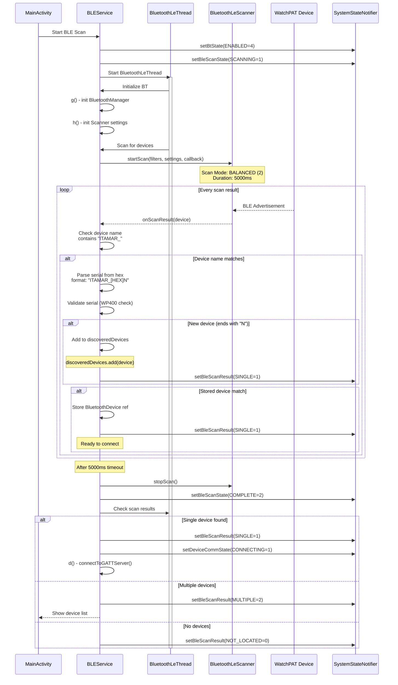

**Key Details:**

- **Scan filters** (`BLEService.java:490-499`):
  - Device name: `ITAMAR_[HEX]` or `ITAMAR_[HEX]N`
  - "N" suffix indicates new/unpaired device

- **Serial parsing** (`BLEService.java:122-124`):
  ```java
  String hexPart = name.replace("ITAMAR_", "").replace("N", "");
  int serialInt = Integer.parseInt(hexPart, 16);
  String serial = String.format("%09d", serialInt);
  ```

- **Scan settings** (`BLEService.java:605`):
  - Scan mode: `SCAN_MODE_BALANCED` (2) - balanced power/latency
  - Timeout: 5000ms

### Scan Cycle Thread

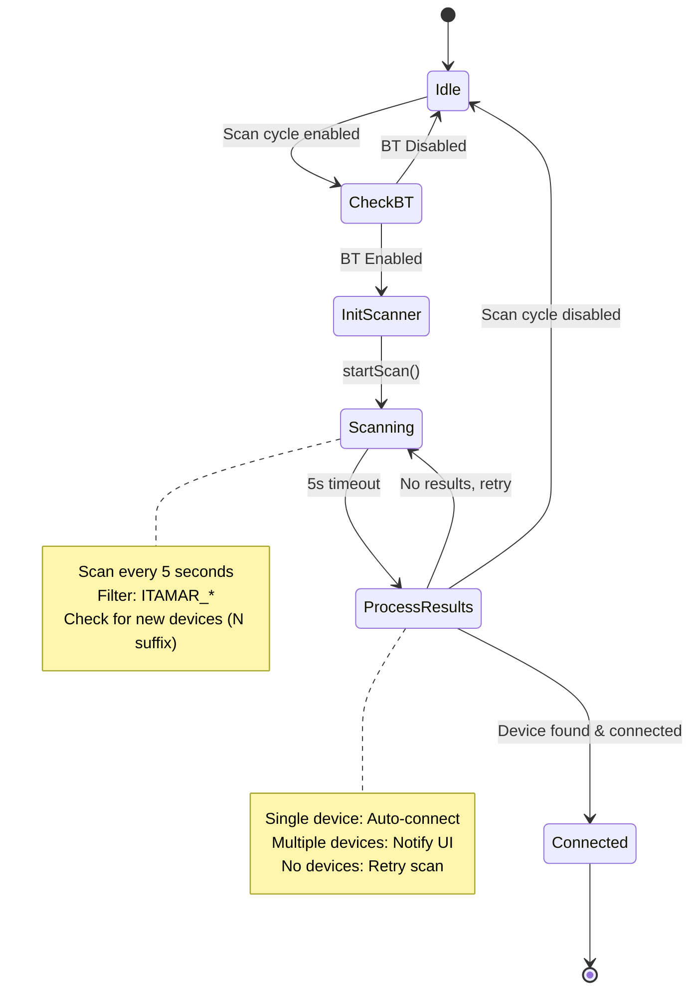

**Scan Cycle Logic** (`BLEService.java:281-321`):
- Runs in separate thread `ScanCycleThread`
- Continuous scanning when:
  - BT is enabled
  - Not connected to device
  - Scan cycle enabled (`Services.d.q()`)
- Stops when:
  - Device connected
  - BT disabled
  - Scan cycle disabled

---

## Connection Establishment

### GATT Connection Flow

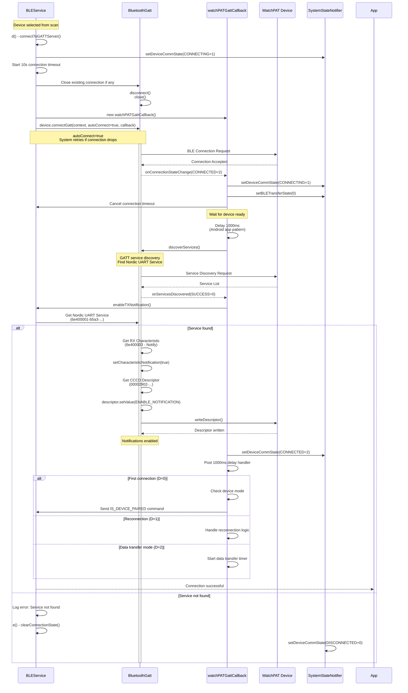

**Connection States** (`SystemStateNotifier.java:49`):
- `0` = Disconnected
- `1` = Connecting
- `2` = Connected
- `3` = Forget

**Connection Parameters**:
- **Auto-connect**: `true` (`BLEService.java:552`)
  - System automatically reconnects if connection drops
- **Connection timeout**: 10 seconds (`BLEService.java:541`)
- **Post-connection delay**: 1000ms (`BLEService.java:368`)
  - Matches Android app pattern
  - Device needs initialization time

---

## GATT Service Discovery

### Service and Characteristic Setup

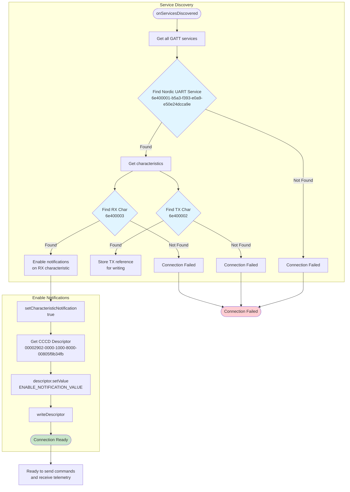

**Nordic UART Service UUIDs** (`BLEService.java:53-56`):

| UUID | Type | Purpose |
|------|------|---------|
| `6e400001-b5a3-f393-e0a9-e50e24dcca9e` | Service | Nordic UART Service |
| `6e400002-b5a3-f393-e0a9-e50e24dcca9e` | TX Characteristic | Write commands to device |
| `6e400003-b5a3-f393-e0a9-e50e24dcca9e` | RX Characteristic | Receive notifications from device |
| `00002902-0000-1000-8000-00805f9b34fb` | CCCD Descriptor | Client Characteristic Configuration |

**Characteristic Properties**:
- **TX (Write)**: `PROPERTY_WRITE_NO_RESPONSE`
- **RX (Notify)**: `PROPERTY_NOTIFY`

---

## Sleep Study Session Start

### Session Initialization Sequence

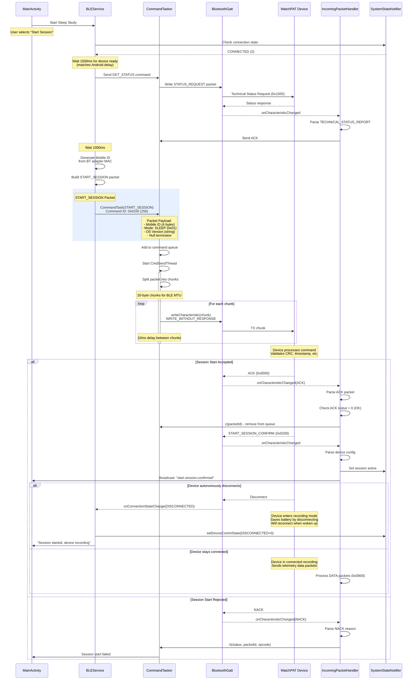

**Session Modes** (`WatchPatProtocol.java:22-27`):
- `0x01` = Sleep session
- `0x02` = Recording mode
- `0x04` = Prepare mode

**START_SESSION Packet Structure** (`DeviceCommands.java:SessionStartCommandPacket`):
```
Header (24 bytes):
  BB BB 00 01 [timestamp] [txn-id] [length] [flags] 00 00 [CRC]

Payload:
  [Mobile ID: 4 bytes]    - From BT adapter MAC address
  [Mode: 1 byte]          - 0x01 for sleep study
  [OS Version: variable]  - e.g., "Windows/10.0"
  [Null: 1 byte]          - 0x00 terminator
```

**Timing Details** (`BLEService.java:368-370`):
- **Post-connection delay**: 1000ms
- **Status check before session**: 1000ms wait
- **Total delay before START_SESSION**: ~2500ms
- Matches Android app pattern: `postDelayed(new d(bLEService, 0), 1000L)`

---

## Data Acquisition & Telemetry

### Packet Reception Flow

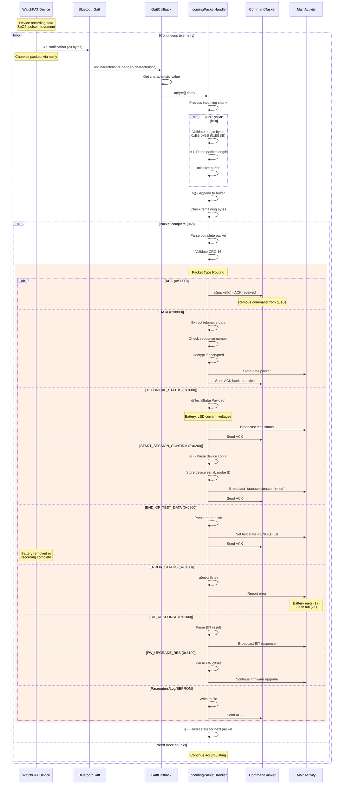

**Packet Types** (`IncomingPacketHandler.java:143-368`):

| Opcode | Decimal | Name | Purpose |
|--------|---------|------|---------|
| 0x0000 | 0 | ACK | Command acknowledgment |
| 0x0200 | 512 | START_SESSION_CONFIRM | Session started confirmation |
| 0x0500 | 1280 | CONFIG_RESPONSE | Device configuration |
| 0x0800 | 2048 | DATA | Telemetry data packet |
| 0x0900 | 2304 | END_OF_TEST_DATA | Recording ended |
| 0x0A00 | 2560 | ERROR_STATUS | Device error report |
| 0x1300 | 4864 | BIT_RES | Built-in test result |
| 0x1600 | 5632 | TECHNICAL_STATUS_REPORT | Device status |
| 0x2B00 | 11008 | IS_DEVICE_PAIRED_RES | Pairing status |
| 0x3100 | 12544 | FW_UPGRADE_RES | Firmware upgrade response |

### Data Packet Processing

```mermaid
flowchart TD
    Start([Receive DATA packet<br/>0x0800]) --> CheckPIN{PIN code<br/>configured?}

    CheckPIN -->|No| Skip[Skip packet]
    CheckPIN -->|Yes| SetFlag[Set m=true<br/>Data receiving]

    SetFlag --> StartTimer[Start DataReceivedTimeout<br/>3000ms]

    StartTimer --> CheckFirst{First data<br/>packet?}

    CheckFirst -->|Yes| FirstPacket[l=true]
    FirstPacket --> SaveConfig[Save PIN code<br/>Save device serial]
    SaveConfig --> ReportStart[Report start to server<br/>EVENT_START_RECORDING]

    CheckFirst -->|No| CheckSeq{Sequence number<br/>valid?}

    ReportStart --> CheckSeq

    CheckSeq -->|New| ProcessData[Extract payload<br/>Store to file]
    CheckSeq -->|Retransmit| LogRetrans[Log retransmission<br/>Skip duplicate]

    ProcessData --> SendAck[Send ACK to device<br/>CommandTasker.d]
    LogRetrans --> SendAck

    SendAck --> UpdateState[Update data transfer state<br/>setDataTransferState(1)]

    UpdateState --> End([Continue receiving])
    Skip --> End

    style CheckPIN fill:#fff4e1
    style FirstPacket fill:#e1f5ff
    style ProcessData fill:#e8f5e9
    style SendAck fill:#c8e6c9
```

**Data Reception Logic** (`IncomingPacketHandler.java:152-189`):

1. **PIN Validation**:
   - Check if PIN code is set (`AppPreferences.G()`)
   - Skip packets if no PIN (device not paired)

2. **First Packet Handling**:
   - Set `l=true` (first data received flag)
   - Save configuration to SharedPreferences
   - Report test start to tracking/server

3. **Sequence Number Check**:
   - Compare with previous remote ID
   - Detect and skip retransmissions
   - Update `AppPreferences.B()` with latest sequence

4. **ACK Response**:
   - Send ACK back to device via `CommandTasker.d()`
   - ACK includes packet ID for tracking

---

## Command/Response Flow

### CommandTasker Queue System

```mermaid
stateDiagram-v2
    [*] --> Idle

    Idle --> AddCommand: e() - Add command
    AddCommand --> QueueCommand: Create CommandTaskerItem

    QueueCommand --> CheckThread{CmdSendThread<br/>running?}
    CheckThread -->|No| StartThread: Start thread
    CheckThread -->|Yes| Queued: Already running

    StartThread --> Sending
    Queued --> Sending

    state Sending {
        [*] --> IterateQueue
        IterateQueue --> BuildPacket: Get next command
        BuildPacket --> SplitChunks: Split into 20-byte chunks

        SplitChunks --> SendLoop
        state SendLoop {
            [*] --> WriteChunk
            WriteChunk --> Delay: 10ms delay
            Delay --> WriteChunk: Next chunk
            Delay --> ChunksDone: All chunks sent
        }

        ChunksDone --> UpdateTimestamp: Set lastSend time
        UpdateTimestamp --> WaitRetry: Wait 2000ms
        WaitRetry --> CheckTimeout: Check timeout (10s)

        CheckTimeout -->|Timeout| HandleTimeout: Disconnect & rescan
        CheckTimeout -->|ACK received| RemoveFromQueue
        CheckTimeout -->|Retry| IterateQueue

        RemoveFromQueue --> [*]
        HandleTimeout --> [*]
    }

    Sending --> Idle: Queue empty

    note right of AddCommand
        Commands added to queue:
        - packetId (unique)
        - priority (short)
        - packet chunks
    end note

    note right of WaitRetry
        Retry logic:
        - 2000ms between attempts
        - 10000ms total timeout
        - ACK removes from queue
    end note
```

**CommandTasker Configuration** (`BLEService.java:771-774`):
```java
commandTasker.i = 10;       // Delay between chunks (ms)
commandTasker.j = 2000;     // Delay between retries (ms)
commandTasker.k = 10000;    // Total timeout (ms)
commandTasker.l = (short) 0; // Priority
```

### Command Send Callback

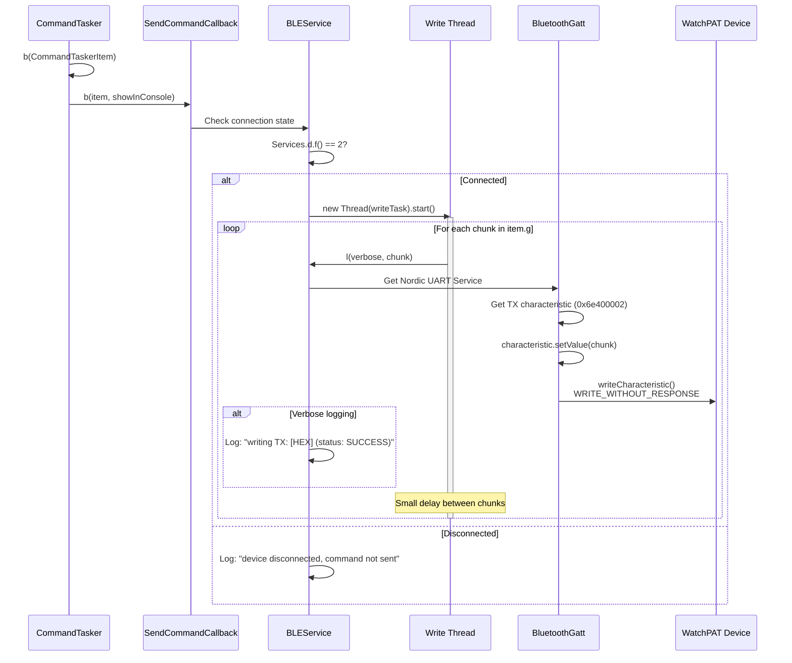

**Write Characteristics** (`BLEService.java:692-722`):
- Method: `l(boolean verbose, byte[] data)`
- Uses `WRITE_WITHOUT_RESPONSE` for speed
- Logs every write operation
- Thread-safe with synchronized block

---

## State Management

### System State Machine

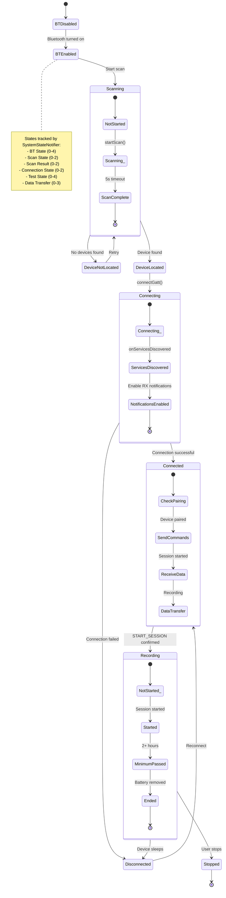

**State Lists** (`SystemStateNotifier.java:45-57`):

```java
// BT State (0-4)
List t = ["None", "Not available", "BLE not supported", "Disabled", "Enabled"]

// Scan Result (0-2)
List u = ["Not located", "Located single", "Located multiple"]

// Scan State (0-2)
List v = ["Not started", "Scanning", "Scanning complete"]

// Connection State (0-3)
List w = ["Disconnected", "Connecting", "Connected", "forget"]

// Test State (0-4)
List z = ["Not started", "Started", "Minimum passed", "Ended", "Stopped"]

// Data Transfer (0-3)
List A = ["Not started", "Transferring", "Uploading to server", "All transferred"]
```

### State Transitions

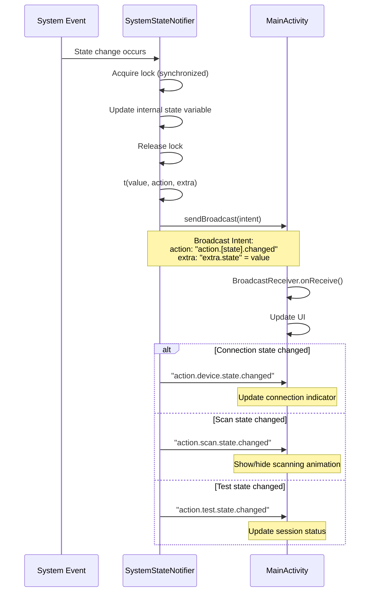

**State Synchronization** (`SystemStateNotifier.java:66-77`):
- All state changes are synchronized on `Object s`
- Prevents race conditions between threads
- Broadcasts intent for UI updates
- Thread-safe getters for state queries

---

## Disconnection & Reconnection

### Disconnection Handling

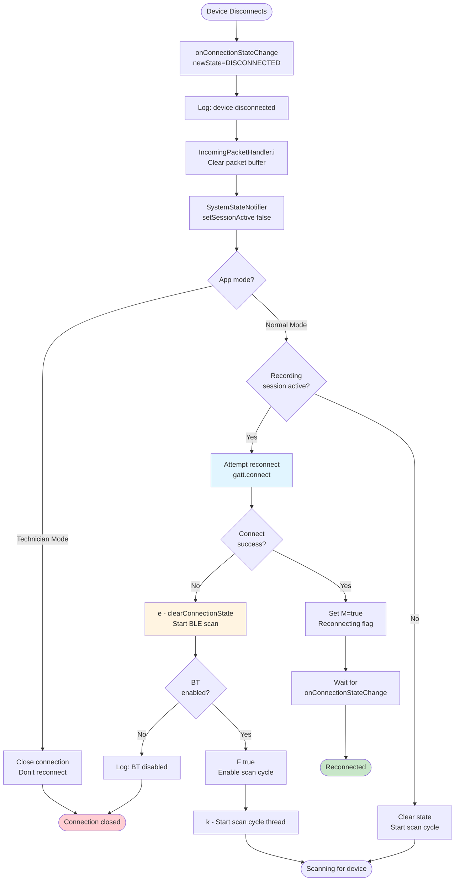

**Disconnection Logic** (`BLEService.java:395-436`):

1. **Immediate Actions**:
   - Track event: `EVENT_WP_DISCONNECTED`
   - Clear `IncomingPacketHandler` state
   - Set `sessionActive = false`

2. **Mode-Specific Handling**:
   - **Technician Mode** (`AppPreferences.v()`): Close connection, don't reconnect
   - **Normal Mode**: Attempt automatic reconnection

3. **Reconnection Strategy**:
   - Try `gatt.connect()` first (fast)
   - If fails, clear state and start scan
   - Enable scan cycle for continuous discovery

### Reconnection Flow

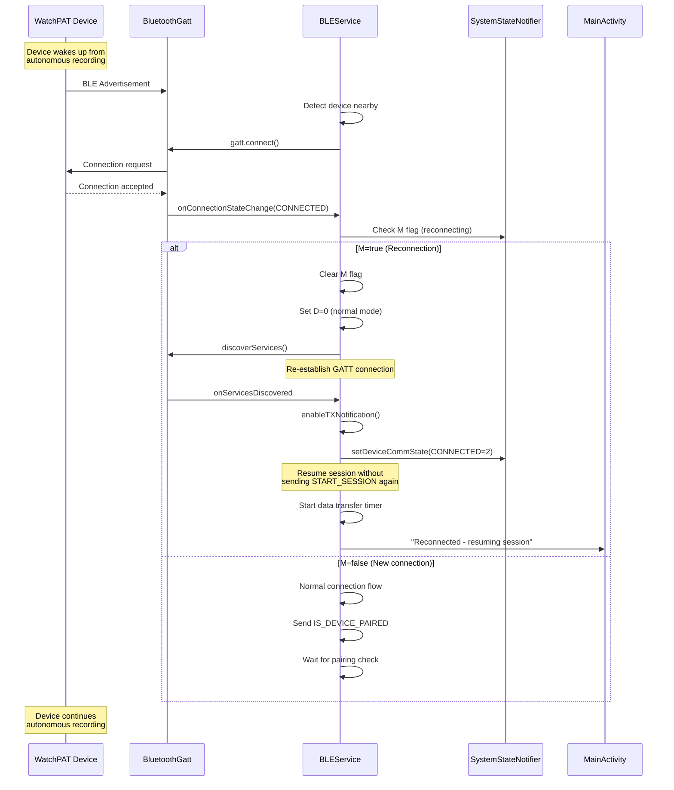

**Reconnection Flags** (`BLEService.java:361-383`):
- **M flag** (`BLEService.java:58`): Indicates reconnection in progress
- **D variable** (`BLEService.java:94`):
  - `0` = Normal first connection
  - `1` = Reconnection after initial pairing
  - `2` = Data transfer mode

---

## Timing Diagrams

### Complete Flow with Timing

```mermaid
gantt
    title WatchPAT BLE Session Timeline
    dateFormat X
    axisFormat %L ms

    section Discovery
    Start BLE scan                 :0, 100
    Scan for devices               :100, 5100
    Stop scan                      :5100, 5200
    Process results                :5200, 5300

    section Connection
    Connect to GATT                :5300, 5500
    Connection established         :5500, 5600
    Wait for device ready          :5600, 6600
    Discover services              :6600, 6800
    Enable notifications           :6800, 7000
    Post-connection delay          :7000, 8000

    section Session Start
    Send STATUS request            :8000, 8100
    Wait for status                :8100, 9100
    Build START_SESSION packet     :9100, 9200
    Send START_SESSION             :9200, 9300
    Wait for ACK                   :9300, 9400
    Wait for CONFIRM               :9400, 10400
    Device processing              :10400, 13400

    section Recording
    Device disconnects (optional)  :13400, 13500
    Autonomous recording           :13500, 21600
    Device sleeps                  :crit, 21600, 50000
```

**Key Timing Values**:
- **Scan duration**: 5000ms
- **Connection timeout**: 10000ms
- **Post-connection delay**: 1000ms
- **Status check wait**: 1000ms
- **Device processing**: ~3000ms
- **Command retry interval**: 2000ms
- **Command timeout**: 10000ms
- **Data receive timeout**: 3000ms

---

## Critical Byte Ordering Issues (SOLVED)

### Problem: Double Byte-Reversal Bug

**Symptom:** Device completely ignores all commands, no RX responses received.

**Root Cause:** Java `ByteBuffer` writes big-endian but pre-reverses values using `Integer.reverseBytes()`, `Short.reverseBytes()`, etc. C# `BitConverter` writes little-endian. Reversing these fields in C# causes **double reversal**.

**Solution:**

```csharp
// CORRECT byte ordering in C# (WatchPatPacket.cs Header.ToBytes())
buffer.AddRange(BitConverter.GetBytes(ReverseBytes(Magic)));      // Reverse: not pre-reversed in Java
buffer.AddRange(BitConverter.GetBytes(ReverseBytes(CommandId)));  // Reverse: not pre-reversed in Java
buffer.AddRange(BitConverter.GetBytes(ReverseBytes(Timestamp)));  // Reverse: IS pre-reversed in Java
buffer.AddRange(BitConverter.GetBytes(TransactionId));            // NO reverse: pre-reversed in Java
buffer.AddRange(BitConverter.GetBytes(Length));                   // NO reverse: pre-reversed in Java
buffer.AddRange(BitConverter.GetBytes(Flags));                    // NO reverse: not reversed in Java
buffer.AddRange(BitConverter.GetBytes(Zero));                     // NO reverse: always 0
buffer.AddRange(BitConverter.GetBytes(Crc));                      // NO reverse: pre-reversed in Java
```

**Before Fix (WRONG):**
```
BB BB 23 00 ... 00 00 00 02 00 19 ...  ← TransactionId and Length reversed twice!
```

**After Fix (CORRECT):**
```
BB BB 23 00 ... 02 00 00 00 19 00 ...  ← Little-endian, device accepts command!
```

### Problem: CRC Calculated Multiple Times

**Symptom:** CRC value changes between logging calls, device rejects packet.

**Root Cause:** `Build()` method called twice (once for logging, once for chunking), recalculating CRC each time.

**Solution:** Cache the built packet to prevent multiple CRC calculations:

```csharp
private byte[] _builtPacket;  // Cache field

public byte[] Build()
{
    if (_builtPacket != null)
        return _builtPacket;  // Return cached

    // Build and calculate CRC once
    _builtPacket = fullPacket;
    return _builtPacket;
}
```

### Problem: Response Parser Looking for Wrong Header

**Symptom:** `[Telemetry] Invalid header, skipping byte: 0xBB`

**Root Cause:** TelemetryHandler looking for `0x55 0xAA` but responses use `0xBB 0xBB`.

**Solution:** Update parser to recognize `0xBB 0xBB` magic number and parse 24-byte headers.

---

## Error Handling

### Error Detection and Recovery

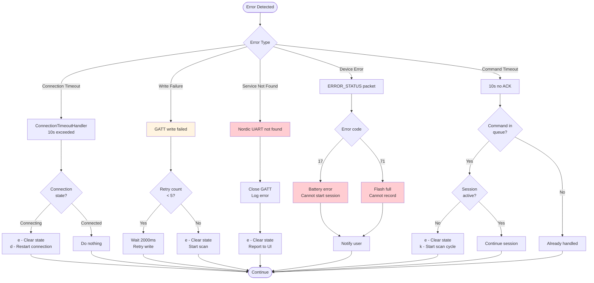

---

## Summary

### Critical Implementation Points

1. **Device Discovery**
   - Filter by name: `ITAMAR_[HEX]` with optional "N" suffix
   - Parse serial from hex to 9-digit decimal
   - Scan timeout: 5000ms
   - Scan cycle for continuous discovery

2. **Connection**
   - Auto-connect enabled for automatic reconnection
   - 10-second connection timeout
   - 1000ms post-connection delay before commands
   - Nordic UART Service (6e400001-...)

3. **Session Start**
   - 1500ms initial wait after connection
   - Status check before session start
   - Mobile ID from BT adapter MAC
   - Device may disconnect after session start (normal)

4. **Data Flow**
   - 20-byte chunks for BLE MTU
   - 10ms delay between chunks
   - CRC-16 validation on all packets
   - ACK required for all data packets

5. **State Management**
   - Thread-safe state synchronization
   - Broadcast intents for UI updates
   - Multiple state dimensions (BT, scan, connection, session)

6. **Error Handling**
   - Automatic reconnection on disconnect
   - Command retry with 2000ms interval
   - 10000ms total timeout per command
   - Scan cycle restart on connection failure

---

## File References

| Component | Source File | Key Lines |
|-----------|-------------|-----------|
| **BLE Service** | `BLEService.java` | 52-938 |
| **GATT Callback** | `BLEService.java:323` | watchPATBluetoothGattCallback |
| **Command Tasker** | `CommandTasker.java` | 16-312 |
| **Packet Handler** | `IncomingPacketHandler.java` | 22-450 |
| **State Notifier** | `SystemStateNotifier.java` | 13-390 |
| **Device Commands** | `DeviceCommands.java` | Packet builders |
| **Scan Callback** | `BLEService.java:96` | ScanCallback.onScanResult |
| **Connection Timeout** | `BLEService.java:259` | ConnectionTimeoutHandler |
| **Bluetooth Thread** | `BLEService.java:211` | BluetoothLeThread |
| **Scan Cycle** | `BLEService.java:281` | ScanCycleThread |

---

## ✅ Implementation Status

**PROTOCOL VERIFIED AND WORKING!**

The C# implementation successfully:
- ✅ Connects to WatchPAT devices via Nordic UART Service
- ✅ Sends commands with proper 24-byte headers and CRC-16
- ✅ Receives and parses ACK responses
- ✅ LED control commands proven working (SetLEDs tested successfully)
- ✅ Ready for sleep study sessions and data acquisition

### Critical Implementation Notes

**Byte Ordering Fixes Applied:**
1. **CommandId**: Must be byte-reversed (C# BitConverter is little-endian, Java ByteBuffer writes big-endian)
2. **TransactionId**: Do NOT reverse (Java pre-reverses with `Integer.reverseBytes()`)
3. **Length**: Do NOT reverse (Java pre-reverses with `Short.reverseBytes()`)
4. **CRC**: Do NOT reverse (Java pre-reverses with `Short.reverseBytes()`)

**Connection Initialization Required:**
- After connection, MUST send `IS_DEVICE_PAIRED` (0x2A00) before other commands
- 1000ms delay required after connection before sending commands
- Device will ignore commands without proper initialization

**Response Format:**
- All responses use same 24-byte header format as commands
- Header starts with `0xBB 0xBB` magic number (not `0x55 0xAA`)
- ACK responses: Command ID = `0x0000`, payload contains acked command ID and status

---

---

## 🎓 Lessons Learned - Debugging Journey

### Issue Timeline

1. **Initial Protocol Discovery** ✅
   - Successfully reverse-engineered 24-byte header structure from `DeviceCommands.java`
   - Identified CRC-16-CCITT algorithm
   - Understood chunking requirements

2. **First Bug: Wrong CommandId Byte Order** ❌ → ✅
   - **Symptom**: Device ignored all commands
   - **Cause**: CommandId was `00 23` instead of `23 00`
   - **Fix**: Added byte reversal for CommandId field
   - **Result**: Commands sent but still no response

3. **Second Bug: Double Byte-Reversal** ❌ → ✅
   - **Symptom**: Device still ignored commands, no RX messages
   - **Cause**: TransactionId and Length reversed twice (`00 00 00 02` instead of `02 00 00 00`)
   - **Discovery**: Java pre-reverses with `Integer.reverseBytes()` before ByteBuffer writes
   - **Fix**: Only reverse Magic, CommandId, and Timestamp; don't reverse pre-reversed fields
   - **Result**: 🎉 **DEVICE RESPONDED!** First ACK received!

4. **Third Bug: CRC Recalculation** ❌ → ✅
   - **Symptom**: CRC different between logging and transmission
   - **Cause**: `Build()` called multiple times
   - **Fix**: Cache built packet to prevent recalculation
   - **Result**: Consistent CRC values

5. **Fourth Bug: Response Parser** ❌ → ✅
   - **Symptom**: "Invalid header, skipping byte: 0xBB"
   - **Cause**: Parser looking for `0x55 0xAA` instead of `0xBB 0xBB`
   - **Fix**: Updated TelemetryHandler to parse 24-byte header responses
   - **Result**: Clean ACK parsing with detailed information

### Key Insights

**Cross-Platform Endianness:**
- Java `ByteBuffer` is **big-endian** by default
- Java code uses `Integer.reverseBytes()` to **pre-reverse** before writing
- C# `BitConverter` is **little-endian** natively
- Must carefully analyze which fields are pre-reversed in Java!

**Protocol Verification Strategy:**
1. Use **LED commands first** - instant visual feedback
2. Log **every byte** of TX and RX data
3. Compare with known-good Android app packets
4. Test incrementally (don't change multiple things at once)

**Debugging Tools:**
- Hex output logging crucial for byte-by-byte comparison
- Transaction ID tracking helps correlate commands with responses
- CRC validation immediately shows packet format errors

### Success Metrics

**Physical Verification:**
- ✅ LED physically turned ON (command 0x2300 with payload 0xFF)
- ✅ LED physically turned OFF (command 0x2300 with payload 0x00)
- ✅ LED blink pattern works (5 on/off cycles)

**Protocol Verification:**
- ✅ Device sends ACK responses (command 0x0000)
- ✅ CRC validation passes on both TX and RX
- ✅ Transaction IDs match between commands and ACKs
- ✅ No disconnections during command execution

---

**Document Version**: 2.1
**Based on**: Android BLEService.java decompiled source + C# verified implementation
**Platform**: Android (reference) and .NET 9.0 with Windows.Devices.Bluetooth APIs
**Protocol Version**: WatchPAT firmware 2.x+
**Last Updated**: January 2025 - Protocol implementation verified with physical WatchPAT device
**Total Development Time**: ~4 hours from initial implementation to LED verification

## C# Implementation Mapping

The .NET implementation mirrors the Android architecture with these equivalents:

| Android Component | C# Equivalent | Purpose |
|-------------------|---------------|---------|
| BLEService.java | WatchPatDevice.cs | Device connection and command transmission |
| DeviceCommands.java | WatchPatProtocol.cs + WatchPatPacket.cs | Command builders and packet structure |
| IncomingPacketHandler.java | TelemetryHandler.cs | Response packet parsing and routing |
| BluetoothLeScanner | BleDeviceScanner.cs | Device discovery via advertisements |
| CommandTasker.java | Built into WatchPatDevice.cs | Command queuing with retry logic |
| MainActivity | Program.cs | Interactive user interface |

**Key Differences:**
- C# implementation uses event-driven async/await pattern instead of Java threads
- No separate command queue class - integrated into WatchPatDevice
- TaskCompletionSource used for command/response correlation instead of callback queues
- Windows.Devices.Bluetooth APIs replace Android BluetoothGatt
- Single-file packet implementation (WatchPatPacket.cs) vs multiple Java classes

